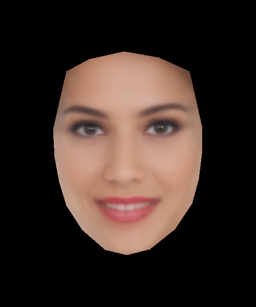

# missItalia17_face-average
Averaging 2017 finalists' faces just for the sake of it

---

1) Web scraper to fetch finalists' pictures from missitalia.it website. 
2) Manual, old-style picture cropping in order to isolate faces
3) Black-box plugging script into [alyssaq/face_morpher](https://github.com/alyssaq/face_morpher)
4) result.png results from [facemorpher/averager.py](https://github.com/alyssaq/face_morpher/blob/master/facemorpher/averager.py). 

### Enjoy

